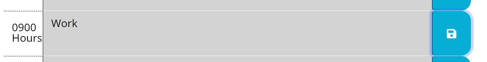
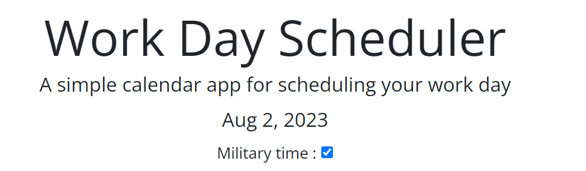

# Work_day_scheduler

link to live site : https://jbird11801.github.io/Work_day_scheduler/

## Description

I loved this project and am going to use it every day to plot out my secdual. I added a full day rather than a 9 to 5 as i dont work only those hours and my scdual is really felxable so a full day made more sense, but 9 - 5 is in a full day so i think that its ok just extra. I also added a way to change it to military time as it allows me to swap as need if people primaraly use that. Overall i think that was my favrite part was making it dynamic so evryone can use this.

## Usage

Input the events that are on the day to day to figure out you dayly work scedual. It contains a full day as to allow you to plot out your day. No matter what scedual you have or work day your faceing.

click the save button after wrighting out your event to save that text to that spot 

also be sure to select what time you prefer military time or normal time simply make sure the box is checked for military time 

## Credits

Used to make the read me file https://courses.bootcampspot.com/courses/3906/pages/3-dot-5-3-create-a-professional-project-readme?module_item_id=885925

how i figured out jqury childeren / find https://api.jquery.com/children/ https://api.jquery.com/find/

dayjs format https://day.js.org/docs/en/display/format

how i made the military time checkbox https://www.w3schools.com/howto/howto_css_switch.asp

how i made the checkbox work in javascript specificly .is thank you @Bhanu Krishnan  https://stackoverflow.com/questions/901712/how-do-i-check-whether-a-checkbox-is-checked-in-jquery

how i learned about this in a click listener functionhttps://developer.mozilla.org/en-US/docs/Web/API/EventTarget/addEventListener

How i learned about.hasClass https://api.jquery.com/hasclass/ https://www.w3schools.com/jquery/html_hasclass.asp

how i learned about .parent https://api.jquery.com/parent/

how i learned how to get the id of a element in the js file https://stackoverflow.com/questions/3239598/how-can-i-get-the-id-of-an-element-using-jquery

## License

Please refrence licence file
