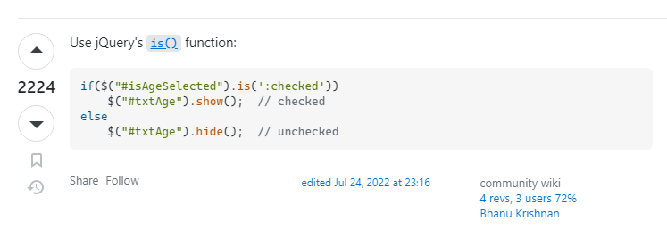

# Work_day_scheduler

## Description

Provide a short description explaining the what, why, and how of your project. Use the following questions as a guide:

- What was your motivation?
- Why did you build this project? (Note: the answer is not "Because it was a homework assignment.")
- What problem does it solve?
- What did you learn?

## Table of Contents (Optional)

If your README is long, add a table of contents to make it easy for users to find what they need.

- [Installation](#installation)
- [Usage](#usage)
- [Credits](#credits)
- [License](#license)

## Installation

What are the steps required to install your project? Provide a step-by-step description of how to get the development environment running.

## Usage

Provide instructions and examples for use. Include screenshots as needed.

To add a screenshot, create an `assets/images` folder in your repository and upload your screenshot to it. Then, using the relative file path, add it to your README using the following syntax:

## Credits

Used to make the read me file https://courses.bootcampspot.com/courses/3906/pages/3-dot-5-3-create-a-professional-project-readme?module_item_id=885925

how i figured out jqury childeren / find https://api.jquery.com/children/ https://api.jquery.com/find/

dayjs format https://day.js.org/docs/en/display/format

how i made the military time checkbox https://www.w3schools.com/howto/howto_css_switch.asp

how i made the checkbox work in javascript specificly .is thank you @Bhanu Krishnan  https://stackoverflow.com/questions/901712/how-do-i-check-whether-a-checkbox-is-checked-in-jquery

how i learned about this in a click listener functionhttps://developer.mozilla.org/en-US/docs/Web/API/EventTarget/addEventListener

How i learned about.hasClass https://api.jquery.com/hasclass/ https://www.w3schools.com/jquery/html_hasclass.asp

how i learned about .parent https://api.jquery.com/parent/

how i l;aerned how to get the id of a element in the js filehttps://stackoverflow.com/questions/3239598/how-can-i-get-the-id-of-an-element-using-jquery

List your collaborators, if any, with links to their GitHub profiles.

If you used any third-party assets that require attribution, list the creators with links to their primary web presence in this section.

If you followed tutorials, include links to those here as well.

## License

The last section of a high-quality README file is the license. This lets other developers know what they can and cannot do with your project. If you need help choosing a license, refer to [https://choosealicense.com/](https://choosealicense.com/).

---

🏆 The previous sections are the bare minimum, and your project will ultimately determine the content of this document. You might also want to consider adding the following sections.

## Badges

Badges aren't necessary, but they demonstrate street cred. Badges let other developers know that you know what you're doing. Check out the badges hosted by [shields.io](https://shields.io/). You may not understand what they all represent now, but you will in time.

## Features

If your project has a lot of features, list them here.

## How to Contribute

If you created an application or package and would like other developers to contribute to it, you can include guidelines for how to do so. The [Contributor Covenant](https://www.contributor-covenant.org/) is an industry standard, but you can always write your own if you'd prefer.

## Tests

Go the extra mile and write tests for your application. Then provide examples on how to run them here.